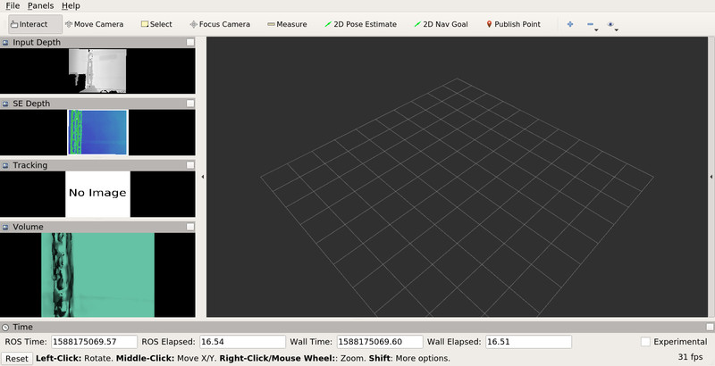

# supereight_ros usage guide

## supereight_ros node

The supereight_ros node creates an instance of a supereight pipeline. The node
allows passing depth and RGB images as well as camera poses to the supereight
pipeline and publishes the resulting map renders.

### Parameters

The following node parameters can be set in a YAML configuration file and then
loaded in a ROS launch file. `config/config.yaml` contains the default
parameter values.

| Parameter name        | Type             | Default value                  | Description |
| :-------------------- | :--------------: | :----------------------------: | :---------- |
| `enable_tracking`     | boolean          | `true`                         | Use the ICP tracking from supereight to compute the camera pose. If set to `false` then the external camera pose from `/pose` will be used instead. |
| `enable_rendering`    | boolean          | `true`                         | Generate and publish the depth, RGB, tracking info and volume render images from supereight. This is only for visualization purposes and doesn't affect the pipeline in any way. |
| `enable_rgb`          | boolean          | `false`                        | Add RGB images to the supereight pipeline. This has no effect in the supereight map for the time being since supereight uses only depth images. The option is available to make it easier to use modified supereight versions that make use of RGB images. |
| `input_res`           | list of integers | `[640, 480]`                   | The resolution of the input depth and RGB images (width, height). This should be set to the correct image resolution since it is used to initialize supereight. |
| `pose_topic_type`     | string           | `"geometry_msgs::PoseStamped"` | The type of the pose topic. Valid values are `geometry_msgs::PoseStamped`  and `geometry_msgs::TransformStamped`. |
| `pose_buffer_size`    | integer          | `600`                          | The number of elements in the pose circular buffer. This should in general be at least an order of magnitude larger than `depth_buffer_size` and `rgb_buffer_size`. |
| `depth_buffer_size`   | integer          | `60`                           | The number of elements in the depth image circular buffer. A low value will result in integrating fairly recent frames into the map. A high value will result in integrating older frames into the map. A value of 1 will result in integrating the most recent depth frame into the map. |
| `rgb_buffer_size`     | integer          | `60`                           | The number of elements in the RGB image circular buffer. |
| `max_timestamp_diff`  | double           | `0.02`                         | The maximum time difference in seconds between a depth and RGB image to consider them matched. |

### Subscribed topics

Messages on these topics are forwarded to supereight as inputs. Remap the
topics you want to forward to supereight to the below topics in a ROS launch
file.

| Topic name            | Type                                       | Description |
| :-------------------- | :----------------------------------------- | :---------- |
| `/camera/depth_image` | `sensor_msgs::Image` (`mono16` or `32FC1`) | The input depth image. The units for `mono16` are millimeters and for `32FC1` they are meters. |
| `/camera/rgb_image`   | `sensor_msgs::Image` (`rgb8` or `rgba8`)   | The input RGB image. Optional, only subscribed to if `enable_rgb` is `true`. |
| `/pose`               | `geometry_msgs::PoseStamped`               | The external or ground truth camera pose. Optional, only subscribed to if `enable_tracking` is `false`. Its type can be changed to `geometry_msgs::TransformStamped` by changing the value of the `pose_topic_type` node argument. |

### Published topics

These topics are published by the supereight_ros node.

| Topic name                  | Type                           | Description |
| :-------------------------- | :----------------------------- | :---------- |
| `/supereight/pose`          | `geometry_msgs::PoseStamped`   | The camera pose as computed by supereight's ICP tracking. Only published if `enable_tracking` is `true`. |
| `/supereight/depth_render`  | `sensor_msgs::Image` (`rgba8`) | The depth image received by supereight. Only published if `enable_rendering` is `true`. |
| `/supereight/rgba_render`   | `sensor_msgs::Image` (`rgba8`) | The RGBA image received by supereight. Only published if both `enable_rendering` and `enable_rgb` are `true`. |
| `/supereight/track_render`  | `sensor_msgs::Image` (`rgba8`) | The ICP tracking status as an image. Only published if both `enable_rendering` and `enable_tracking` are `true`. |
| `/supereight/volume_render` | `sensor_msgs::Image` (`rgba8`) | The map render from the current pose. Only published if `enable_rendering` is `true`. |


## Launch files

Several ROS launch files for different use cases are provided in `launch/`.

| Filename                                    | Description |
| :------------------------------------------ | :---------- |
| `supereight_ros.launch`                     | The standard supereight_ros launch file. It is a good idea to include in in any custom supereight_ros launch files as it sets up most things. It sets the logging level, reads the configuration from `config/config.yml` and remaps some topic names to the subscribed ones.  |
| `supereight_ros_gazebo_example.launch`      | Launch file to use with the Gazebo minimal example from [here](https://bitbucket.org/smartroboticslab/gazebo_minimal_example/). It includes `supereight_ros.launch`, reads the configuration from `config/config_gazebo_example.yml` and remaps the Gazebo topic names to the ones subscribed to by supereight_ros. |
| `supereight_ros_tum.launch`                 | Launch file to use with the TUM RGBD datasets in ROS bag format. It includes `supereight_ros.launch`, reads the configuration from `config/config_tum.yml` and remaps the TUM topic names to the ones subscribed to by supereight_ros. |
| `supereight_ros_gdb.launch`                 | Launches supereight_ros through GDB for debugging. It just included `supereight_ros.launch` and changes the command prefix to run it using GDB. |
| `supereight_ros_valgrind.launch`            | Launches supereight_ros through valgrind for profiling. It just included `supereight_ros.launch` and changes the command prefix to run it using valgrind. |
| `supereight_ros_ICRA2020_experiment.launch` | No need to use this expect as an example on how to structure a custom launch file for supereight_ros. |

If none of the above launch files cover your needs, use either
`supereight_ros_tum.launch` or `supereight_ros_ICRA2020_experiment.launch` as a
base for your custom launch file.

### Node arguments

The standard supereight_ros launch file, `supereight_ros.launch`, accepts the
following node arguments. These arguments can be overridden by other launch
files that include `supereight_ros.launch`.

| Argument name                | Description |
| :--------------------------- | :---------- |
| `supereight_ros_config_file` | The YAML configuration file to load. It contains the supereight_ros node parameter settings as well as the supereight settings. |
| `depth_image_topic`          | The name of the depth image topic the supereight_ros node will subscribe to. |
| `rgb_image_topic`            | The name of the RGB image topic the supereight_ros node will subscribe to. |
| `pose_topic`                 | The name of the camera pose topic the supereight_ros node will subscribe to. |
| `command_prefix`             | A shell command to add before the command starting the supereight_ros node. It can be used to e.g. run the supereight_ros node using a debugger. |


## Changing the voxel implementation

supereight can be compiled with several voxel implementations. supereight_ros
uses the `OFusion` (single-resolution occupancy mapping) voxel implementation
by default. To use a different voxel implementation change the value of the
`SE_VOXEL_IMPLEMENTATION` from `OFusion` to `TSDF`, `MultiresTSDF` or
`MultiresOFusion` in `CMakeLists.txt` and recompile supereight_ros.


## `rviz` Visualization

An `rviz` configuration file is provided in `config/supereight_ros.rviz`. To
use it run

``` bash
rviz -d config/supereight_ros.rviz
```

Something like the screenshot below should appear



